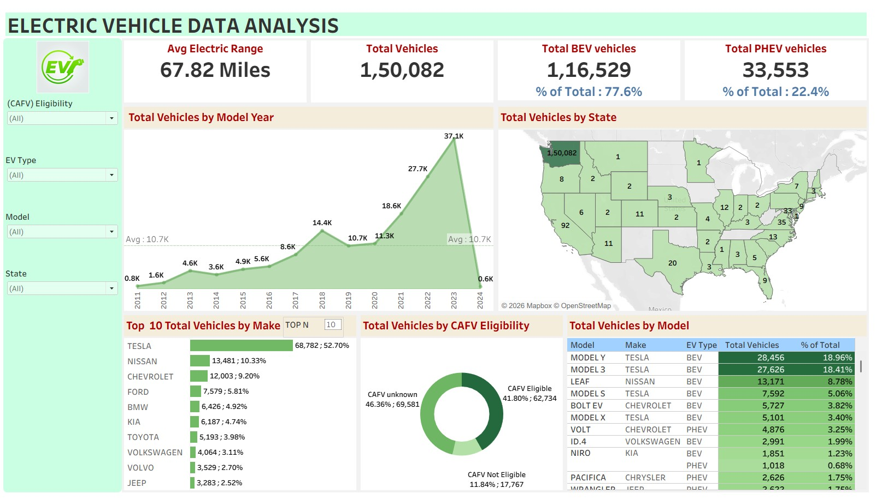

# Electric Vehicle Data Analysis Dashboard

## 📌 Project Overview

This Tableau project analyzes electric vehicle population data to understand EV adoption trends, vehicle types, manufacturers, model popularity, geographic distribution, electric range, and Clean Alternative Fuel Vehicle (CAFV) eligibility.

The dashboard provides an interactive view of electric vehicle registrations across model years and states, along with manufacturer and model-level analysis.

## 🎯 Business Objective

The objective of this project is to analyze electric vehicle adoption patterns and identify trends across vehicle types, manufacturers, models, locations, model years, and CAFV eligibility categories.

## 📊 Dataset

The project uses the `Electric_Vehicle_Population_Data.csv` dataset.

### Dataset Details

* Source records: 150,482
* Dashboard vehicles: 150,082
* Average Electric Range: 67.82 miles
* BEV vehicles shown: 116,529
* PHEV vehicles shown: 33,553
* BEV share: 77.6%
* PHEV share: 22.4%
* Model Year range in source data: 1997–2024

### Key Fields

* VIN (1-10)
* County
* City
* State
* Postal Code
* Model Year
* Make
* Model
* Electric Vehicle Type
* Clean Alternative Fuel Vehicle (CAFV) Eligibility
* Electric Range
* Base MSRP
* Legislative District
* DOL Vehicle ID
* Vehicle Location
* Electric Utility
* 2020 Census Tract

## 🛠️ Tools & Technologies

* Tableau
* CSV
* Data Visualization
* Geographic Analysis
* Electric Vehicle Analytics
* Business Intelligence

## 📈 Dashboard KPIs

| KPI                    |       Value |
| ---------------------- | ----------: |
| Average Electric Range | 67.82 Miles |
| Total Vehicles         |     150,082 |
| Total BEV Vehicles     |     116,529 |
| Total PHEV Vehicles    |      33,553 |
| BEV Share              |       77.6% |
| PHEV Share             |       22.4% |

## 📊 Dashboard Analysis

### Electric Vehicle Type

Battery Electric Vehicles (BEVs) represent the majority of vehicles in the dashboard.

* BEV: 116,529
* PHEV: 33,553

BEVs account for approximately **77.6%** of the dashboard vehicle population, while PHEVs account for **22.4%**.

### Vehicles by Model Year

The dashboard shows a strong increase in EV registrations over time.

Vehicle counts rise from approximately **0.8K in 2011** to a peak of approximately **37.1K in 2023**, followed by a much lower count for 2024 in the displayed dataset.

The trend indicates substantial growth in EV adoption in recent model years.

### Vehicles by State

The dashboard shows a strong geographic concentration of EVs in Washington State, with approximately **150K vehicles** represented there.

Other states have significantly smaller vehicle counts in comparison.

### Top 10 Manufacturers

Tesla is the leading manufacturer in the dashboard with approximately **68.8K vehicles**, followed by:

* Nissan: 13.5K
* Chevrolet: 12.0K
* Ford: 7.6K
* BMW: 6.4K
* Kia: 6.2K
* Toyota: 5.2K
* Volkswagen: 4.1K
* Volvo: 3.5K
* Jeep: 3.3K

### CAFV Eligibility

The dashboard divides vehicles into three CAFV eligibility categories:

* CAFV Eligible: 62,734
* CAFV Unknown: 69,581
* CAFV Not Eligible: 17,767

The large number of vehicles with unknown eligibility highlights an opportunity for more complete eligibility information.

### Top Models

Tesla models dominate the top positions.

The leading models shown include:

* Model Y
* Model 3
* Nissan Leaf
* Tesla Model S
* Chevrolet Bolt EV
* Tesla Model X
* Chevrolet Volt
* Volkswagen ID.4
* Kia Niro
* Chrysler Pacifica

## 🔍 Key Insights

1. BEVs account for approximately **77.6%** of the dashboard vehicle population.
2. PHEVs account for approximately **22.4%**.
3. The average electric range is approximately **67.82 miles**.
4. EV registrations show strong growth across recent model years, reaching approximately **37.1K vehicles in 2023**.
5. **Tesla** is the dominant manufacturer, with approximately **68.8K vehicles**.
6. **Model Y and Model 3** are the two leading models in the dashboard.
7. Washington has a significantly higher EV count than the other states represented.
8. Approximately **69.6K vehicles** fall into the CAFV eligibility-unknown category, making it the largest eligibility segment.
9. CAFV-eligible vehicles account for approximately **41.8%** of the dashboard population.

## 💡 Business Recommendations

* Continue monitoring the rapid growth of EV adoption across recent model years.
* Analyze factors contributing to Tesla's strong market presence.
* Investigate opportunities to expand EV adoption in states with lower vehicle counts.
* Improve CAFV eligibility data completeness to support more accurate policy and incentive analysis.
* Use model-level trends to understand consumer preferences and guide EV infrastructure planning.
* Compare BEV and PHEV adoption patterns when planning charging infrastructure and related services.

## 📷 Dashboard Preview



## 📁 Repository Structure

```text
Tableau-Electric-Vehicle-Data-Analysis/
│
├── README.md
├── github 4th Tableu.twbx
├── Electric_Vehicle_Population_Data.csv
└── dashboard tableau .jpg
```

## 🚀 How to Use

1. Download or clone this repository.
2. Open `github 4th Tableu.twbx` using Tableau Desktop.
3. Explore the interactive dashboard.
4. Use the filters for CAFV Eligibility, EV Type, Model, and State to analyze different segments.

## 👩‍💻 Skills Demonstrated

* Tableau Dashboard Development
* Data Visualization
* Geographic Analysis
* Trend Analysis
* Electric Vehicle Analytics
* KPI Development
* Manufacturer Analysis
* Model-Level Analysis
* Data Segmentation
* Business Intelligence
